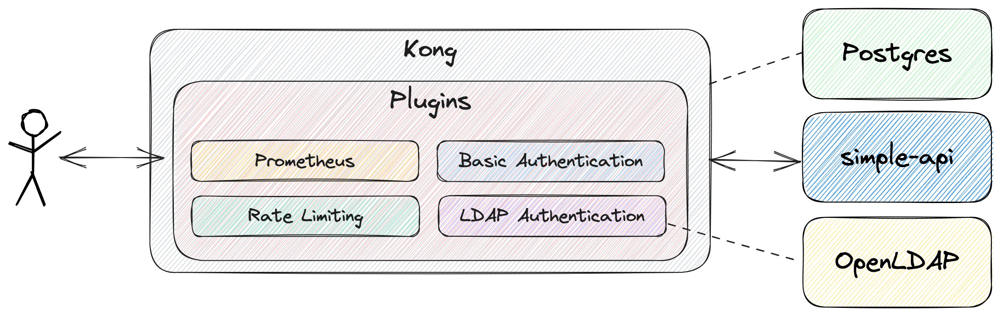
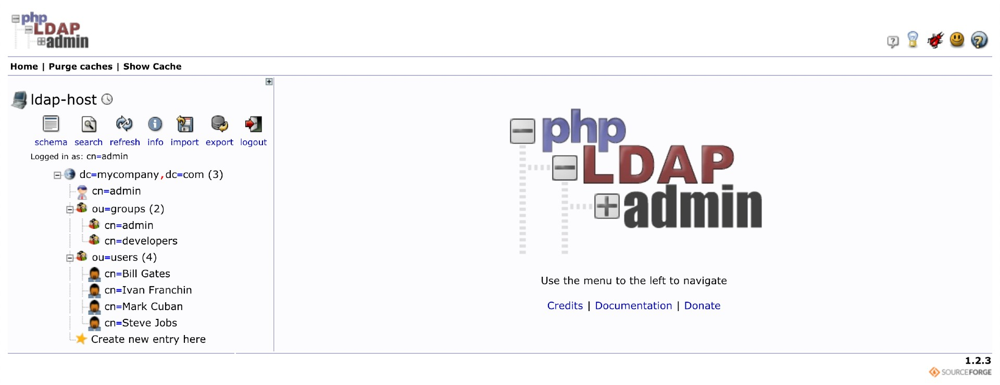

# springboot-kong-plugins

The goal of this project is to create a simple [`Spring Boot`](https://docs.spring.io/spring-boot/docs/current/reference/htmlsingle/) REST API and securing it with [`Kong`](https://konghq.com/kong/) using the `LDAP Authentication` and `Basic Authentication` plugins. Besides, we will explore more plugins that `Kong` offers like: `Rate Limiting` and `Prometheus` plugins.

## Proof-of-Concepts & Articles

On [ivangfr.github.io](https://ivangfr.github.io), I have compiled my Proof-of-Concepts (PoCs) and articles. You can easily search for the technology you are interested in by using the filter. Who knows, perhaps I have already implemented a PoC or written an article about what you are looking for.

## Additional Readings

- \[**Medium**\] [**Using Kong to secure a Simple Spring Boot REST API with Basic Authentication plugin**](https://medium.com/javarevisited/using-kong-to-secure-a-simple-spring-boot-rest-api-with-basic-authentication-plugin-90f3529043f3)

## Project Diagram



## Application

- ### simple-service

  `Spring Boot` Java Web application that exposes two endpoints:
   - `/api/public`: that can be access by anyone, it is not secured;
   - `/api/private`: that must be accessed only by authenticated users.

## Prerequisites

- [`Java 17+`](https://www.oracle.com/java/technologies/downloads/#java17)
- [`Docker`](https://www.docker.com/)

## Run application during development using Maven

- Open a terminal and navigate to `springboot-kong-plugins` root folder

- Run the command below to start
  ```
  ./mvnw clean spring-boot:run --projects simple-service
  ```

- Open another terminal and call application endpoints
  ```
  curl -i localhost:8080/api/public
  curl -i localhost:8080/api/private
  curl -i localhost:8080/actuator/beans
  curl -i localhost:8080/actuator/health
  ```

- To stop, go to the terminal where the application is running and press `Ctrl+C`

## Build application Docker Image

- In a terminal, make sure you are in `springboot-kong-plugins` root folder

- Build Docker Image
  - JVM
    ```
    ./docker-build.sh
    ```
  - Native
    ```
    ./docker-build.sh native
    ```
    
## Test application Docker Image

- In a terminal, run the following command
  ```
  docker run --rm -p 8080:8080 --name simple-service ivanfranchin/simple-service:1.0.0
  ```

- Open another terminal and call application endpoints
  ```
  curl -i localhost:8080/api/public
  curl -i localhost:8080/api/private
  curl -i localhost:8080/actuator/beans
  curl -i localhost:8080/actuator/health
  ```

- To stop, go to the terminal where the application is running and press `Ctrl+C`

## Initialize Environment

- In a terminal, make use you are in `springboot-kong-plugins` root folder

- Run the following script
  ```
  ./init-environment.sh
  ```
  > **Note**: `simple-service` application is running as a Docker container. The container does not expose any port to HOST machine. So, it cannot be accessed directly, forcing the caller to use `Kong` as gateway server in order to access it.

## Import OpenLDAP Users

The `LDIF` file that we will use, `ldap/ldap-mycompany-com.ldif`, has already a pre-defined structure for `mycompany.com`. Basically, it has 2 groups (`developers` and `admin`) and 4 users (`Bill Gates`, `Steve Jobs`, `Mark Cuban` and `Ivan Franchin`). Besides, it's defined that `Bill Gates`, `Steve Jobs` and `Mark Cuban` belong to `developers` group and `Ivan Franchin` belongs to `admin` group.
```
Bill Gates > username: bgates, password: 123
Steve Jobs > username: sjobs, password: 123
Mark Cuban > username: mcuban, password: 123
Ivan Franchin > username: ifranchin, password: 123
```

There are two ways to import those users: by running a script or using `phpldapadmin`

### Import users running a script

- In another terminal, make use you are in `springboot-kong-plugins` root folder

- Run the following script
  ```
  ./import-openldap-users.sh
  ```
  
- Check users imported using [`ldapsearch`](https://linux.die.net/man/1/ldapsearch)
  ```
  ldapsearch -x -D "cn=admin,dc=mycompany,dc=com" \
    -w admin -H ldap://localhost:389 \
    -b "ou=users,dc=mycompany,dc=com" \
    -s sub "(uid=*)"
  ```

### Import users using phpldapadmin

- Access https://localhost:6443

- Login with the credentials
  ```
  Login DN: cn=admin,dc=mycompany,dc=com
  Password: admin
  ```

- Import the file `ldap/ldap-mycompany-com.ldif`

- You should see something like

  

## Kong

In a terminal, follow the steps below to configure `Kong`

### Check Status

- Before starting, check if `Kong` admin API is accessible
  ```
  curl -I http://localhost:8001
  ```

  It should return
  ```
  HTTP/1.1 200 OK
  ```

### Add Service

1. The following call will add the `simple-service` service
   ```
   curl -i -X POST http://localhost:8001/services/ \
     -d "name=simple-service" \
     -d "protocol=http" \
     -d "host=simple-service" \
     -d "port=8080"
   ```

2. \[Optional\] To list all services run
   ```
   curl -i http://localhost:8001/services
   ```

### Add routes

1. One default route for the service, no specific `path` included
   ```
   curl -i -X POST http://localhost:8001/services/simple-service/routes/ \
     -d "name=simple-service-default" \
     -d "protocols[]=http" \
     -d "hosts[]=simple-service"
   ```

2. Another route specifically for `/api/private` endpoint (it will be secured and only accessible by LDAP users)
   ```
   curl -i -X POST http://localhost:8001/services/simple-service/routes/ \
     -d "name=simple-service-api-private" \
     -d "protocols[]=http" \
     -d "hosts[]=simple-service" \
     -d "paths[]=/api/private" \
     -d "strip_path=false"
   ```

3. Finally, one route for `/actuator/beans` endpoint (it will be secured and only accessible by pre-defined users)
   ```
   curl -i -X POST http://localhost:8001/services/simple-service/routes/ \
     -d "name=simple-service-actuator-beans" \
     -d "protocols[]=http" \
     -d "hosts[]=simple-service" \
     -d "paths[]=/actuator/beans" \
     -d "strip_path=false"
   ```

4. \[Optional\] To list all `simple-service` routes run
   ```
   curl -i http://localhost:8001/services/simple-service/routes
   ```

### Call endpoints

1. Call `/api/public` endpoint
   ```
   curl -i http://localhost:8000/api/public -H 'Host: simple-service'
   ```

   It should return
   ```
   HTTP/1.1 200
   It is public.
   ```

2. Call `/api/private` endpoint
   ```
   curl -i http://localhost:8000/api/private -H 'Host: simple-service'
   ```

   It should return
   ```
   HTTP/1.1 200
   null, it is private.
   ```

   > **Note**: This endpoint is not secured by the application, that is why the response is returned. The idea is to use `Kong` to secure it. It will be done on the next steps.

3. Call `/actuator/beans` endpoint
   ```
   curl -i http://localhost:8000/actuator/beans -H 'Host: simple-service'
   ```

   It should return
   ```
   HTTP/1.1 200
   {"contexts":{"simple-service":{"beans":...
   ```

   > **Note**: As happened previously with `/api/private`, `/actuator/beans` endpoint is not secured by the application. We will use `Kong` to secure it on the next steps.

## Plugins

In this project, we are going to add these plugins: `LDAP Authentication`, `Basic Authentication`, `Rate Limiting` and `Prometheus`. Please refer to https://konghq.com/plugins for more.

### Add LDAP Authentication plugin

The `LDAP Authentication` plugin will be used to secure the `/api/private` endpoint.

1. Add plugin to route `simple-service-api-private`
   ```
   curl -i -X POST http://localhost:8001/routes/simple-service-api-private/plugins \
     -d "name=ldap-auth" \
     -d "config.hide_credentials=true" \
     -d "config.ldap_host=openldap" \
     -d "config.ldap_port=389" \
     -d "config.start_tls=false" \
     -d "config.base_dn=ou=users,dc=mycompany,dc=com" \
     -d "config.verify_ldap_host=false" \
     -d "config.attribute=cn" \
     -d "config.cache_ttl=60" \
     -d "config.header_type=ldap"
   ```

2. Try to call `/api/private` endpoint without credentials
   ```
   curl -i http://localhost:8000/api/private -H 'Host: simple-service'
   ```

   It should return
   ```
   HTTP/1.1 401 Unauthorized
   {"message":"Unauthorized"}
   ```

3. Call `/api/private` endpoint using Bill Gates base64 encode credentials
   ```
   curl -i http://localhost:8000/api/private \
     -H "Authorization:ldap $(echo -n 'Bill Gates':123 | base64)" \
     -H 'Host: simple-service'
   ```

   It should return
   ```
   HTTP/1.1 200
   Bill Gates, it is private.
   ```

### Add Basic Authentication plugin

The `Basic Authentication` plugin will be used to secure the `/actuator/beans` endpoint

1. Add plugin to route `simple-service-actuator-beans`
   ```
   curl -i -X POST http://localhost:8001/routes/simple-service-actuator-beans/plugins \
     -d "name=basic-auth" \
     -d "config.hide_credentials=true"
   ```

2. Try to call `/actuator/beans` endpoint without credentials.
   ```
   curl -i http://localhost:8000/actuator/beans -H 'Host: simple-service'
   ```

   It should return
   ```
   HTTP/1.1 401 Unauthorized
   {"message":"Unauthorized"}
   ```

3. Create a consumer
   ```
   curl -i -X POST http://localhost:8001/consumers -d "username=ivanfranchin"
   ```

4. Create a credential for consumer
   ```
   curl -i -X POST http://localhost:8001/consumers/ivanfranchin/basic-auth \
     -d "username=ivan.franchin" \
     -d "password=123"
   ```

5. Call `/api/private` endpoint using `ivan.franchin` credential
   ```
   curl -i -u ivan.franchin:123 http://localhost:8000/actuator/beans -H 'Host: simple-service'
   ```

   It should return
   ```
   HTTP/1.1 200
   {"contentDescriptor":{"providerVersion":...
   ```

6. Let's create another consumer just for testing purpose
   ```
   curl -i -X POST http://localhost:8001/consumers -d "username=administrator"
   
   curl -i -X POST http://localhost:8001/consumers/administrator/basic-auth \
     -d "username=administrator" \
     -d "password=123"
   ```

### Add Rate Limiting plugin

We are going to add the following rate limitings:
- `/api/public` and `/actuator/health`: one request per second
- `/api/private`: 5 requests a minute
- `/actuator/beans`: 2 requests a minute or 100 requests an hour

1. Add plugin to route `simple-service-default`
   ```
   curl -i -X POST http://localhost:8001/routes/simple-service-default/plugins \
     -d "name=rate-limiting" \
     -d "config.second=1"
   ```

2. Add plugin to route `simple-service-api-private`
   ```
   curl -i -X POST http://localhost:8001/routes/simple-service-api-private/plugins \
     -d "name=rate-limiting" \
     -d "config.minute=5"
   ```

3. Add plugin to route `simple-service-actuator-beans`
   ```
   curl -i -X POST http://localhost:8001/routes/simple-service-actuator-beans/plugins \
     -d "name=rate-limiting" \
     -d "config.minute=2" \
     -d "config.hour=100"
   ```

4. Make some calls to these endpoints

   - Test `/api/public`
     ```
     curl -i http://localhost:8000/api/public -H 'Host: simple-service'
     curl -i http://localhost:8000/actuator/health -H 'Host: simple-service'
     ```

   - Test `/actuator/beans`
     ```
     curl -i -u ivan.franchin:123 http://localhost:8000/actuator/beans -H 'Host: simple-service'
     curl -i -u administrator:123 http://localhost:8000/actuator/beans -H 'Host: simple-service'
     ```

   - Test `/api/private`
     ```
     curl -i http://localhost:8000/api/private \
       -H "Authorization:ldap $(echo -n 'Bill Gates':123 | base64)" \
       -H 'Host: simple-service'
     
     curl -i http://localhost:8000/api/private \
       -H "Authorization:ldap $(echo -n 'Mark Cuban':123 | base64)" \
       -H 'Host: simple-service'
     ```

5. After exceeding some calls in a minute, you should see
   ```
   HTTP/1.1 429 Too Many Requests
   {"message":"API rate limit exceeded"}
   ```

### Add Prometheus plugin

1. Add plugin to `simple-service`
   ```
   curl -i -X POST http://localhost:8001/services/simple-service/plugins -d "name=prometheus"
   ```

2. Make some requests to `simple-service` endpoints

3. You can see some metrics
   ```
   curl -i http://localhost:8001/metrics
   ```

## Shutdown

In a terminal and, inside `springboot-kong-plugins` root folder, run the following script
```
./shutdown-environment.sh
```

## Cleanup

To remove the Docker image created by this project, go to a terminal and, inside `springboot-kong-plugins` root folder, run the script below
```
./remove-docker-images.sh
```

## Issues

When upgrading postgres to a version above `13.x` (using current kong version), there is an error while running `kong-database migration`
```
Running kong-database migration
-------------------------------
Error: module 'openssl.rand' not found:No LuaRocks module found for openssl.rand
	no field package.preload['openssl.rand']
	no file './openssl/rand.lua'
	no file './openssl/rand/init.lua'
	no file './openssl/rand.lua'
	no file './openssl/rand/init.lua'
	no file '/usr/local/openresty/site/lualib/openssl/rand.ljbc'
	no file '/usr/local/openresty/site/lualib/openssl/rand/init.ljbc'
	no file '/usr/local/openresty/lualib/openssl/rand.ljbc'
	no file '/usr/local/openresty/lualib/openssl/rand/init.ljbc'
	no file '/usr/local/openresty/site/lualib/openssl/rand.lua'
	no file '/usr/local/openresty/site/lualib/openssl/rand/init.lua'
	no file '/usr/local/openresty/lualib/openssl/rand.lua'
	no file '/usr/local/openresty/lualib/openssl/rand/init.lua'
	no file './openssl/rand.lua'
	no file '/usr/local/openresty/luajit/share/luajit-2.1.0-beta3/openssl/rand.lua'
	no file '/usr/local/share/lua/5.1/openssl/rand.lua'
	no file '/usr/local/share/lua/5.1/openssl/rand/init.lua'
	no file '/usr/local/openresty/luajit/share/lua/5.1/openssl/rand.lua'
	no file '/usr/local/openresty/luajit/share/lua/5.1/openssl/rand/init.lua'
	no file '/home/kong/.luarocks/share/lua/5.1/openssl/rand.lua'
	no file '/home/kong/.luarocks/share/lua/5.1/openssl/rand/init.lua'
	no file '/usr/local/openresty/site/lualib/openssl/rand.so'
	no file '/usr/local/openresty/lualib/openssl/rand.so'
	no file './openssl/rand.so'
	no file '/usr/local/lib/lua/5.1/openssl/rand.so'
	no file '/usr/local/openresty/luajit/lib/lua/5.1/openssl/rand.so'
	no file '/usr/local/lib/lua/5.1/loadall.so'
	no file '/home/kong/.luarocks/lib/lua/5.1/openssl/rand.so'
	no file '/usr/local/openresty/site/lualib/openssl.so'
	no file '/usr/local/openresty/lualib/openssl.so'
	no file './openssl.so'
	no file '/usr/local/lib/lua/5.1/openssl.so'
	no file '/usr/local/openresty/luajit/lib/lua/5.1/openssl.so'
	no file '/usr/local/lib/lua/5.1/loadall.so'
	no file '/home/kong/.luarocks/lib/lua/5.1/openssl.so'

  Run with --v (verbose) or --vv (debug) for more details
```